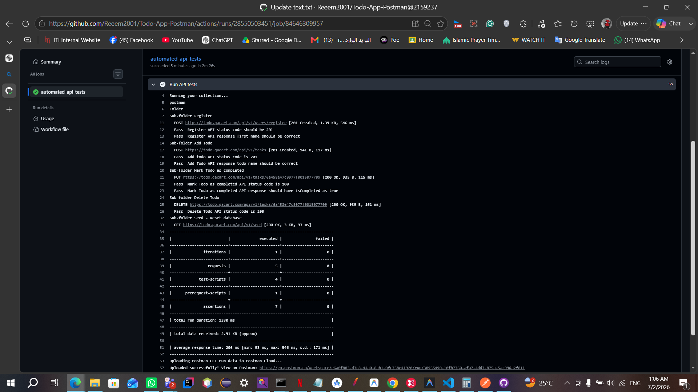

#  API Testing Automation Project (Postman + GitHub Actions)

## 📖 Overview

This project is an automated API testing E2E scenario built using **Postman Collections** and executed via **Postman CLI in GitHub Actions**.
It tests a full Todo application workflow including user registration, authentication, task management, and database seeding.

The goal is to ensure API reliability through **continuous integration testing (CI/CD)**.

---

## 🚀 Tech Stack

* Postman (Collections & Tests)
* Postman CLI
* GitHub Actions (CI/CD)
* JavaScript (Postman test scripts)
* REST API (Todo Application)

---

## 🔗 API Under Test

Base URL:

```
https://todo.qacart.com
```

### Endpoints Covered:

* POST `/api/v1/register` → Register user
* POST `/api/v1/tasks` → Create todo
* PUT `/api/v1/tasks/:id` → Mark todo as completed
* DELETE `/api/v1/tasks/:id` → Delete todo
* GET `/api/v1/seed` → Reset database

---

## ⚙️ How It Works

1. A random user is generated using Postman dynamic variables
2. User is registered and authentication token is stored
3. Token is used for authorized requests
4. A todo is created, updated, and deleted
5. Database is reset using seed endpoint
6. Assertions validate response correctness

---

## 🧪 Test Scenarios

### ✔ User Registration

* Validate status code = 201
* Validate response contains correct first name
* Store authentication token

### ✔ Create Todo

* Validate status code = 201
* Validate todo name correctness

### ✔ Update Todo

* Validate status code = 200
* Validate `isCompleted = true`

### ✔ Delete Todo

* Validate status code = 200

### ✔ Seed Database

* Validate successful reset

---

## 🔐 Authentication Flow

* Token is generated during user registration/login
* Token is stored using Postman environment variables
* Used in all protected endpoints

---

## 🛠️ Running Locally (Postman)

1. Import collection into Postman
2. Import environment file
3. Select environment
4. Click **Run Collection**

---

## 🤖 Running via GitHub Actions (CLI)

The tests are executed automatically using Postman CLI:

```bash
postman collection run <collection-id> -e <environment-id>
```

CI pipeline runs:

* All API tests
* Assertions validation
* Reports results in GitHub Actions logs

---

## 🚀 CI/CD Pipeline (GitHub Actions)

Below is a sample execution of the automated API tests running in GitHub Actions:



